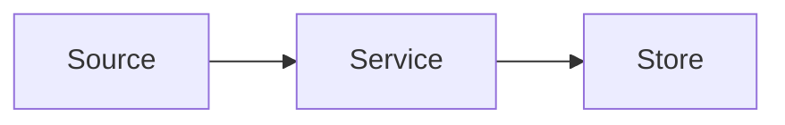

# ERD Template

Use this template when creating or substantially restructuring an Engineering
Requirements Doc. Remove sections that are not relevant. Do not leave prompt
text in the final artifact.

````markdown
---
title: [Project Name] ERD
status: draft
created: YYYY-MM-DD
updated: YYYY-MM-DD
parent: ../prd.md
---

# [Project Name] ERD

## Team

**Engineering**

- ERD owner:
- Tech lead:
- Frontend:
- Backend:
- Mobile:
- DevOps / SRE:
- QA:
- Data / analytics:
- Security / privacy:

**Cross-Functional**

- Engineering manager:
- Product manager:
- Product operations:
- Designer:
- Data analyst / scientist:
- Other stakeholders:

## Quick Links

- Slack channel:
- Planning board:
- PRD:
- UX spec / design files:
- Codebase architecture map:
- API documentation:
- Testing dashboard:
- Monitoring and alerts:
- Related docs:

## Source Inputs And Readiness

- PRD:
- PRD review:
- Roadmap:
- UX spec / UX review:
- Codebase architecture map:
- Existing code / system evidence:
- Other inputs:

### Readiness Override

Include this section only when proceeding despite missing readiness inputs.

- Missing input:
- Accepted by:
- Reason for proceeding:
- Remaining risk:

## Problem Statement

[What user or system problem are we solving? Link back to product and UX
sources rather than restating them at length.]

## Goals And Metrics

- Engineering goals:
- Product or operational success signals:
- Metrics this ERD must enable or protect:

## Scope

### Will Do

- [Engineering scope included in this ERD.]

### Will Not Do

- [Explicit engineering exclusions.]

## Assumptions

- [ASSUMPTION: assumption text, owner, validation path if needed.]

## Open Questions

### Blockers Before ERD Review

| Question | Owner | Needed By | Notes |
| --- | --- | --- | --- |
|  |  |  |  |

### Non-Blocking Follow-Ups

| Question | Owner | Notes |
| --- | --- | --- |
|  |  |  |

## Architecture

### Summary

[Concise target architecture summary and why it fits the product/UX constraints.]

### Current State

[For brownfield work, summarize the relevant current systems, modules, data,
APIs, events, jobs, integrations, constraints, and known risks.]

### Target State

[Describe the proposed architecture, boundaries, responsibilities, dependencies,
and important runtime behavior.]

### Diagrams

Use inline Mermaid when a diagram clarifies the design. Move large or numerous
diagrams to `engineering/diagrams/` and link them here.



### Database Schema Changes

| Object | Change | Compatibility / Migration Notes |
| --- | --- | --- |
|  |  |  |

### Event Or Message Updates

| Event / Message | Producer | Consumer | Change | Notes |
| --- | --- | --- | --- | --- |
|  |  |  |  |  |

### Integrations / External Dependencies

| Dependency | Purpose | Failure Mode | Mitigation |
| --- | --- | --- | --- |
|  |  |  |  |

### Migrations, Backfills, And Compatibility

- Migration/backfill approach:
- Backwards compatibility:
- Mixed-version or mixed-state behavior:
- Data validation:

## Alternatives Considered

| Option | Pros | Cons | Decision |
| --- | --- | --- | --- |
|  |  |  |  |

## Payload & API Updates

Include only when API, payload, object attribute, compatibility, or versioning
details matter.

### Endpoint / Contract Summary

| API / Contract | Change | Compatibility Notes |
| --- | --- | --- |
|  |  |  |

### Request / Response Examples

```json
{
  "example": true
}
```

### Object Attribute Changes

| Object | Attribute | Change | Notes |
| --- | --- | --- | --- |
|  |  |  |  |

## Assignment Strategy

Include only when experiments, staged rollout cohorts, feature flags,
permissions, routing, sharding, tenancy, migrations, or bucketing behavior
affects engineering behavior.

- Assignment unit:
- Eligibility rules:
- Stickiness / reassignment behavior:
- Exposure controls:
- Debugging and support visibility:

## Instrumentation

- Events to add or change:
- Where events are fired:
- Required properties:
- Tracking spec:
- Data quality checks:

## Monitoring & Operations

- Health metrics:
- Logs:
- Dashboards:
- Alerts:
- Runbook notes:
- On-call or support handoff:

## Testing Strategy

Name coverage obligations and risk areas. Do not write detailed test cases.

- Unit coverage:
- Integration coverage:
- Contract coverage:
- E2E / manual coverage:
- Migration or backfill validation:
- Load / performance validation:
- Regression coverage:

## Non-Functional Requirements

Use only relevant rows.

| Requirement Area | Expected Behavior | Validation / Evidence |
| --- | --- | --- |
| Performance / latency |  |  |
| Scalability |  |  |
| Reliability |  |  |
| Security |  |  |
| Privacy |  |  |
| Compliance |  |  |
| Accessibility |  |  |
| Localization |  |  |
| Data retention |  |  |
| Auditability |  |  |
| Backwards compatibility |  |  |
| Cost |  |  |

## Rollout, Rollback, And Runbook

- Rollout controls:
- Staged exposure:
- Migration/backfill sequencing:
- Monitoring gates:
- Disable path:
- Rollback strategy:
- Post-launch verification:
- Runbook link or notes:

## Risks And Mitigations

| Risk | Impact | Mitigation | Owner |
| --- | --- | --- | --- |
|  |  |  |  |

## Approval Status

| Reviewer / Role | Area Reviewed | Status / Date | Notes |
| --- | --- | --- | --- |
| Engineering manager | Scope and engineering ownership |  |  |
| Tech lead | Architecture and implementation feasibility |  |  |
| Product manager | Product scope alignment |  |  |
| Design | UX alignment |  |  |
| Data / analytics | Instrumentation and metrics |  |  |
| QA | Testing strategy |  |  |
| DevOps / SRE | Operations, monitoring, rollout, rollback |  |  |
| Security / privacy | Security, privacy, compliance |  |  |

## Changelog

| Date | Change | Author |
| --- | --- | --- |
| YYYY-MM-DD | Initial draft |  |
````
