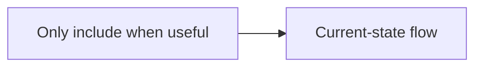

# Codebase Architecture Map Template

Use this template for `engineering/codebase-architecture-map.md`. Right-size
detail to the PRD scope. Keep all headings, even in compact mode, and mark
irrelevant sections `not-applicable`.

Coverage statuses:

- `mapped`
- `partially-mapped`
- `not-found`
- `not-applicable`
- `needs-human-context`

Recommended next-step values:

- `ready-for-author-erd`
- `needs-more-codebase-discovery`
- `needs-human-operational-context`
- `needs-prd-or-ux-clarification`
- `needs-prototype/spike`

Use inline citations for material claims:

- `[src/api/users.ts:42]`
- `[package.json]`
- `[docs/initiatives/.../prd.md]`
- `[command: npm run list-routes]`
- `[Official API docs: URL]`

## Frontmatter

```yaml
---
title: [Product/PRD Name] Codebase Architecture Map
status: draft
parent: ../prd.md
updated: YYYY-MM-DD
---
```

Allowed `status` values:

- `draft`
- `needs-more-discovery`
- `ready-for-erd`

## Template

````markdown
# [Product/PRD Name] Codebase Architecture Map

## Summary

- **Architecture scope:** [Feature slice, subsystem escalation, or compact map]
- **Map status:** [draft / needs-more-discovery / ready-for-erd]
- **Recommended next step:** [ready-for-author-erd / needs-more-codebase-discovery / needs-human-operational-context / needs-prd-or-ux-clarification / needs-prototype/spike]
- **Blocking gaps:** [None / concise list]
- **Primary impacted areas:** [systems, packages, services, modules]

## Source Inputs

| Source | Type | Role In This Map | Notes |
| --- | --- | --- | --- |
| `../prd.md` | PRD | Product scope | [status, relevant IDs] |
| `../prd-review.md` | PRD review | Readiness gate | [recommendation or missing] |
| `../ux/ux-spec.md` | UX | UX gate | [ready/draft/missing/not-applicable] |
| `[path]` | Code/config/test/doc | Evidence | [short note] |

## Gate State

| Gate | State | Evidence | Impact |
| --- | --- | --- | --- |
| PRD scope | pass / provisional / blocked | [citation] | [impact on map] |
| PRD review | pass / provisional / missing / blocked | [citation] | [impact on map] |
| UX | ready / draft-missing / not-applicable / blocked | [citation] | [impact on map] |
| Release scope | clear / provisional / missing | [citation] | [impact on map] |
| Existing architecture docs | present / missing / stale | [citation] | [impact on map] |

## Scope-To-Architecture Traceability

| PRD / UX scope item | Existing system or module | Evidence | Tests / coverage | ERD implication |
| --- | --- | --- | --- | --- |
| [FR-1 / UJ-1 / UX-001 / named scope] | [path/module/service] | [citation] | [citation or gap] | [must/should/watch] |

## Repo Topology

**Coverage status:** [mapped / partially-mapped / not-found / not-applicable / needs-human-context]

[Briefly describe monorepo/app/service/package layout. Go deep only on impacted areas.]

## Relevant Systems And Ownership Boundaries

**Coverage status:** [status]

[Systems, apps, services, modules, ownership boundaries, shared libraries, platform dependencies, and known boundaries that the ERD must respect.]

## Module Boundaries And Local Conventions

**Coverage status:** [status]

[Relevant directory structure, layering, dependency direction, naming, framework patterns, generated code boundaries, and conventions.]

## Domain Language And Business Rules

**Coverage status:** [status]

[Domain concepts, overloaded terms, invariants, lifecycle states, permission/business rules, and naming rules encoded in code or docs. Mark not-applicable for purely technical changes.]

## Data Models, Storage, And Migrations

**Coverage status:** [status]

[Tables, collections, schemas, migrations, ORM models, data ownership, indexes, retention, backfills, compatibility constraints, and gaps.]

## APIs, Contracts, And Payloads

**Coverage status:** [status]

[Routes, controllers, RPC methods, GraphQL operations, SDK/client contracts, request/response payloads, validation, versioning, generated clients, and compatibility constraints.]

## Events, Jobs, Queues, And Async Flows

**Coverage status:** [status]

[Background jobs, scheduled tasks, queues, event buses, webhooks, retries, idempotency, ordering, failure handling, and gaps.]

## Integrations And External Dependencies

**Coverage status:** [status]

[External APIs, SaaS dependencies, SDKs, partner contracts, auth scopes, rate limits, ownership, sandbox/prod differences, and official docs if behavior matters.]

## Runtime, Configuration, Deployment, And Rollback

**Coverage status:** [status]

[Environment variables, secrets references, config files, feature flags, CI/CD, deployment units, migrations at deploy time, release toggles, rollback constraints, and ownership.]

## Observability And Operations

**Coverage status:** [status]

[Logging, metrics, traces, dashboards, alerts, runbooks, incident history if visible, support tools, operational ownership, and human-context gaps.]

## Security, Privacy, And Compliance

**Coverage status:** [status]

[AuthN/AuthZ, permissions, PII, secrets, audit logs, compliance constraints, data residency, payments, regulated data, AI trust/safety, and gaps. Mark not-applicable only with rationale.]

## Performance And Scalability

**Coverage status:** [status]

[Latency, throughput, batch sizes, concurrency, realtime behavior, data volume, caching, query cost, AI/API cost, rate limits, and known bottlenecks.]

## Tests And Validation Surface

**Coverage status:** [status]

[Relevant unit/integration/e2e tests, fixtures, mocks, factories, test commands, coverage patterns, missing critical coverage, and targeted validation commands. Do not create tests here.]

## Existing Diagrams

**Coverage status:** [status]

[Link existing diagrams. Add Mermaid only when it clarifies non-trivial boundaries, data movement, events/jobs, or runtime interactions.]



## Codebase Constraints And Conventions

**Coverage status:** [status]

[Constraints the ERD should preserve or deliberately challenge: layering, transaction boundaries, generated code, shared packages, dependency injection, error handling, localization, accessibility hooks, release practices, or team conventions.]

## Risks And Weak Signals

| Risk | Evidence | Impact | ERD handling |
| --- | --- | --- | --- |
| [Risk] | [citation] | [impact] | [must decide / should account for / watch] |

## Unknowns And Human-Context Needs

| Unknown | Why It Matters | Current Evidence | Owner / Follow-Up |
| --- | --- | --- | --- |
| [Unknown] | [impact] | [citation or needs-human-context] | [who/what to ask] |

## ERD Questions And Implications

### Must-Decide

| Question / implication | Evidence | Affected PRD / UX scope | Why it must be decided in ERD |
| --- | --- | --- | --- |
| [ERD must decide...] | [citation] | [FR/UJ/UX item] | [reason] |

### Should-Decide

| Question / implication | Evidence | Affected PRD / UX scope | Why it should be decided |
| --- | --- | --- | --- |
| [ERD should decide/account for...] | [citation] | [scope] | [reason] |

### Watch-List

| Watch item | Evidence | Affected scope | Trigger for escalation |
| --- | --- | --- | --- |
| [Watch item] | [citation] | [scope] | [condition] |

## Recommended Next Step

**Value:** [ready-for-author-erd / needs-more-codebase-discovery / needs-human-operational-context / needs-prd-or-ux-clarification / needs-prototype/spike]

[One concise paragraph explaining why this is the right next step.]

## Changelog

| Date | Change | Source |
| --- | --- | --- |
| YYYY-MM-DD | Initial architecture map. | [source/user/headless] |

## Self-Check

- [ ] PRD scope is resolved enough to bound architecture discovery.
- [ ] UX gate is handled as ready, draft/missing with no blocking architecture dependency, or not applicable.
- [ ] Impacted systems, packages, services, modules, contracts, data, tests, runtime/deploy, observability, security/privacy/compliance, and performance/scalability have been considered.
- [ ] Material claims have citations.
- [ ] Per-section coverage statuses are present.
- [ ] Scope-to-architecture traceability exists.
- [ ] Risks and unknowns are separated from confirmed facts.
- [ ] Operational gaps are marked `needs-human-context` when unresolved.
- [ ] ERD questions are grouped as `must-decide`, `should-decide`, and `watch-list`.
- [ ] The map does not choose target architecture, implementation tasks, estimates, code changes, or ticket-level plans.
````
